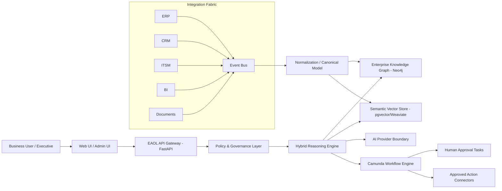

# EAOL Architecture

## Target product

EAOL is a sovereign cognitive layer above enterprise systems. It does not replace ERP, CRM, BI, HRIS, ITSM, MES, or procurement platforms. It creates a unified enterprise model, correlates fragmented signals, explains anomalies, and orchestrates governed actions.

## Recommended alpha architecture

## Core runtime services

| Service | Responsibility | Alpha implementation |
|---|---|---|
| API Gateway | Expose tenant-scoped APIs | FastAPI |
| Connector Factory | Pull/push data from systems | Mock connectors first |
| Event Bus | Decouple ingestion | Kafka-compatible locally |
| Normalization | Map source data to canonical EAOL schema | Pydantic models |
| Graph Service | Enterprise context and dependencies | Neo4j target |
| Vector Service | Semantic document/context retrieval | pgvector target |
| Reasoning Service | Rules + causal scoring + LLM synthesis | Python engine |
| Workflow Service | BPMN, approvals, action orchestration | Camunda 8 / Zeebe |
| Audit Service | Evidence trace and immutable decisions | Append-only table target |
| Security | RBAC/ABAC/tenant isolation | Policy boundary first |

## Local-first principle

The alpha must work in three levels:

1. **No infrastructure mode**: mock AI + in-memory reasoning, unit/API tests pass.
2. **Local infrastructure mode**: Postgres, Neo4j, Kafka, Camunda via Docker Compose.
3. **Enterprise mode later**: Kubernetes, observability, SIEM, SSO, managed secrets.

DevOps hardening is intentionally deferred, but architecture boundaries are already enterprise-grade.

## Enterprise blueprint

A complete non-implementation architecture package for EAOL enterprise readiness is available in:

- [EAOL Enterprise Blueprint](./eaol-enterprise-blueprint/README.md)

It covers target architecture, development flow, Kubernetes/OKD deployment, customer delivery, enterprise system integration, security/compliance, sprint planning through production, and profitability/business model.
