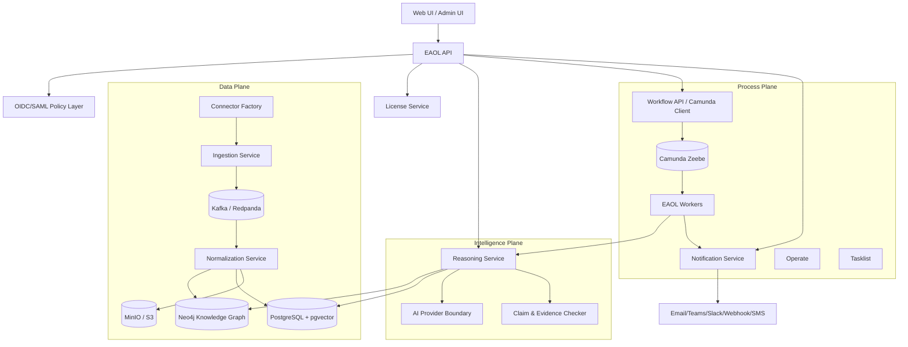

# EAOL Target Architecture — Development-Ready Blueprint

## Product objective

EAOL is an enterprise cognitive operating layer. It connects fragmented enterprise systems, builds a graph of business context, explains anomalies, recommends next-best actions, and orchestrates governed execution through BPMN workflows.

It must work for any sector: construction/civil engineering, finance, insurance, IT operations, manufacturing, mechanical industry, public sector, logistics, healthcare, energy, and any enterprise with fragmented data and decisions.

## Recommended technology choices

| Layer | Recommended tech | Why |
|---|---|---|
| API | FastAPI | Python-native AI ecosystem, fast local iteration, OpenAPI generated automatically |
| Workflow/BPMN | Camunda 8 / Zeebe | Enterprise BPMN, human tasks, auditability, process versioning |
| Event streaming | Kafka-compatible Redpanda locally, Kafka in enterprise | Reliable event backbone, high throughput, easier local operations with Redpanda |
| Operational DB | PostgreSQL | Strong relational integrity, tenant/license/audit metadata |
| Vector DB | pgvector first, Weaviate optional later | Start simple in Postgres; scale semantic search later if needed |
| Knowledge graph | Neo4j | Mature graph traversal for dependencies, root-cause paths, impact analysis |
| Cache/queue | Redis | Rate limits, sessions, short-lived workflow state, notification throttling |
| Object store | MinIO locally, S3/Azure Blob/GCS later | Documents, evidence files, exports, attachments |
| Identity | Keycloak locally, OIDC/SAML enterprise | SSO-ready, RBAC/ABAC, realm per deployment |
| Notifications | SMTP/Mailhog, Teams, Slack, webhooks, SMS | Enterprise alert routing and human-in-the-loop |
| AI provider | Provider boundary: mock/OpenAI/Azure/Mistral/local LLM | Sovereign deployment and customer-specific policy |
| Observability later | OpenTelemetry + Prometheus + Grafana + Loki/Tempo | DevOps phase, but architecture is prepared |

## Service map

## Local development modes

1. **Unit mode:** no Docker required, mock AI, in-memory event bus.
2. **Integration mode:** Docker Compose with Postgres/pgvector, Neo4j, Redpanda, Camunda, Keycloak, Redis, MinIO, Mailhog.
3. **Enterprise mode later:** Kubernetes/Helm/IaC, managed secrets, observability, SIEM, HA databases.

## Domain boundaries

- `apps/api`: public API, OpenAPI, tenant-scoped endpoints.
- `apps/ingestion`: connector ingestion and event envelope creation.
- `apps/workers`: Camunda workers for service tasks.
- `apps/license`: entitlement, metering, offline license validation later.
- `apps/notifications`: enterprise notification routing.
- `packages/eaol_core`: reusable domain logic and pure business services.
