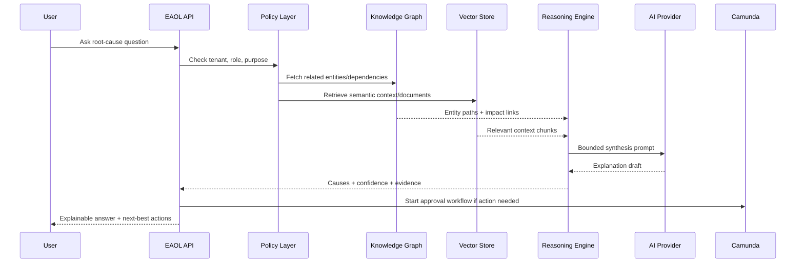
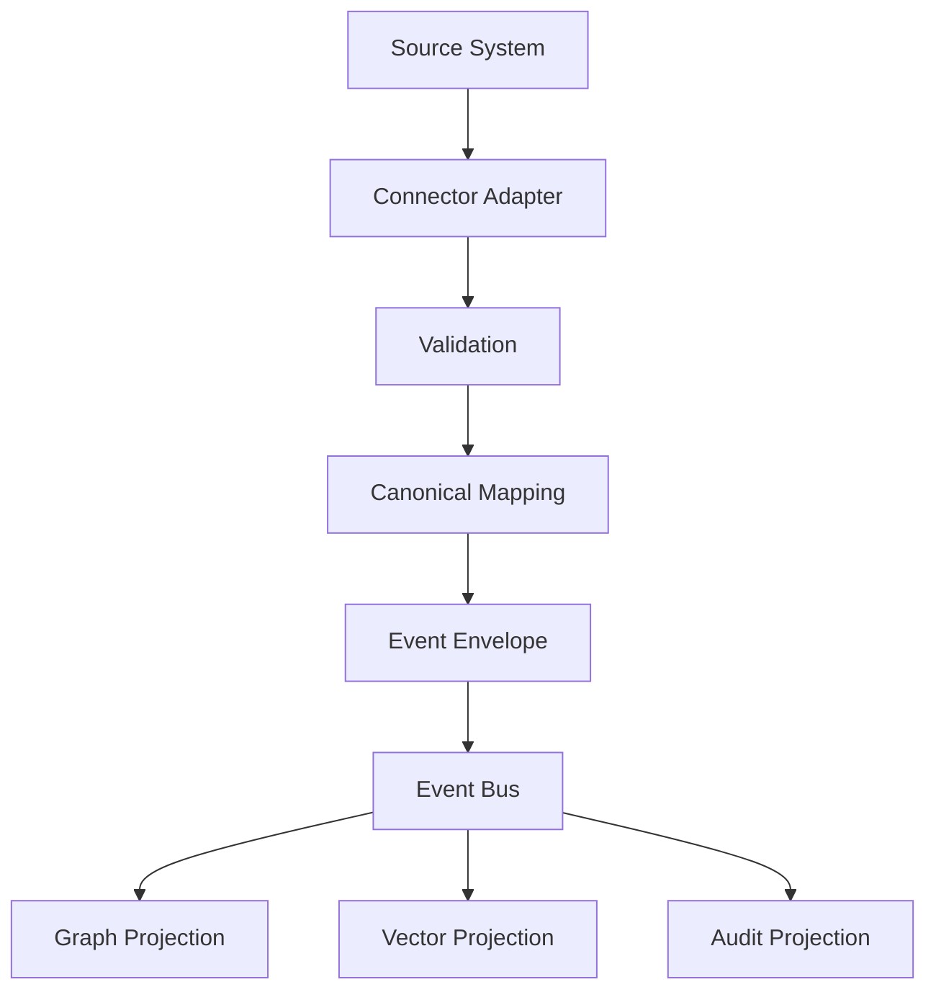
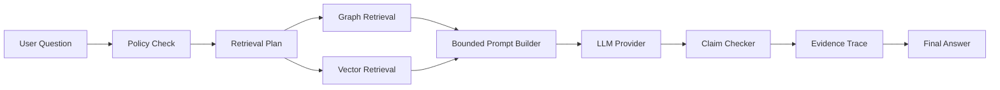

# EAOL Blueprints

## Blueprint 1 — Enterprise Causal Intelligence

**Goal:** explain why a business anomaly happened.

### Flow

### Output contract

- Probable causes ranked by confidence
- Evidence trace for every claim
- Impacted entities and dependencies
- Recommended actions
- Human approval requirement before execution

## Blueprint 2 — Connector Factory

Connector categories:

- API pull connectors
- Webhook/event connectors
- Batch import connectors
- CDC connectors
- Document ingestion connectors

## Blueprint 3 — Governed AI Integration

Rules:

1. No LLM answer without evidence references.
2. No external action without Camunda approval.
3. AI provider is swappable: mock, OpenAI, Azure OpenAI, Mistral, local LLM.
4. Tenant data never crosses provider boundary unless policy allows it.
