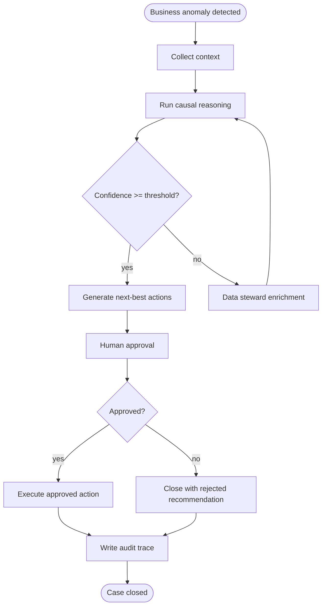

# Camunda BPMN Design

## Process: `eaol-root-cause-analysis`

## Worker task types

| BPMN task | Worker type | Responsibility |
|---|---|---|
| Collect context | `eaol.collect-context` | Retrieve graph/vector/source evidence |
| Run causal reasoning | `eaol.run-causal-reasoning` | Rank probable causes |
| Generate actions | `eaol.generate-actions` | Propose governed next-best actions |
| Execute action | `eaol.execute-approved-action` | Call connector only after approval |
| Audit trace | `eaol.write-audit-trace` | Persist evidence and decision trail |

## Human-in-the-loop

Sensitive automation stays blocked until a human validates:

- external system updates
- customer/supplier communication
- financial adjustment
- HR or compliance action
- high-impact operational change
