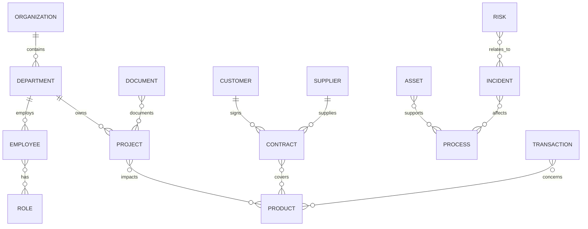

# Enterprise Knowledge Graph Model

## Core entities



## Key relationships

- `REPORTS_TO`
- `OWNS`
- `DEPENDS_ON`
- `SUPPLIES`
- `IMPACTS`
- `PARTICIPATES_IN`
- `CAUSES`
- `BLOCKS`
- `RELATED_TO`
- `LOCATED_IN`

## Minimal Cypher seed concept

```cypher
MERGE (org:Organization {id: 'demo-org', name: 'Demo Enterprise'})
MERGE (supplier:Supplier {id: 'supplier-acme', name: 'Supplier ACME'})
MERGE (incident:Incident {id: 'incident-line-3', name: 'Production delay line 3'})
MERGE (product:Product {id: 'product-a', name: 'Product A'})
MERGE (supplier)-[:SUPPLIES]->(product)
MERGE (incident)-[:IMPACTS]->(product)
```
